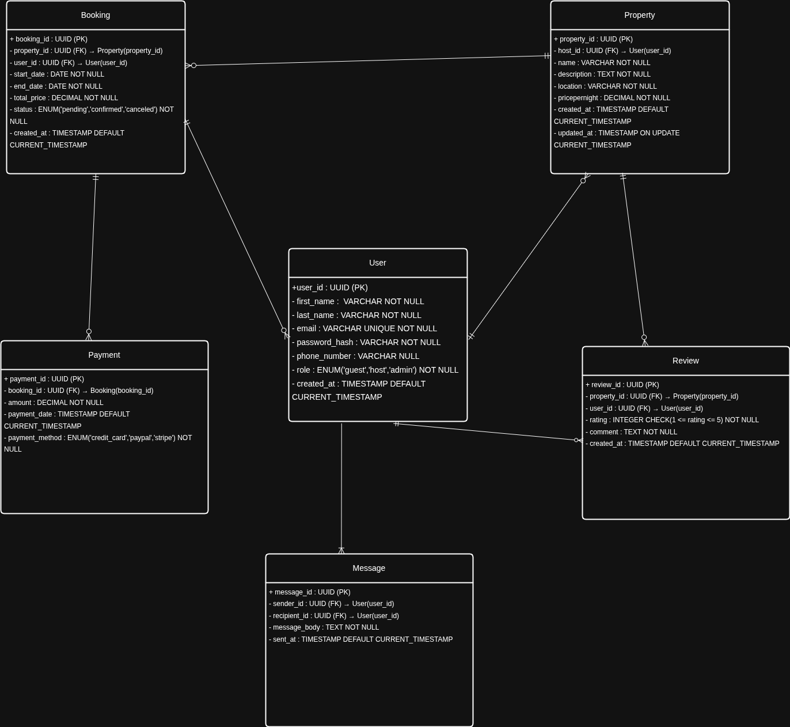

# ER Diagram Specification for Airbnb Database

## ✅ Objective
This document outlines the entity-relationship (ER) diagram for the Airbnb database project. It identifies the key entities, their attributes, and the relationships between them as visualized in the accompanying ER diagram.

---

## 📦 Entities and Attributes

### 1. User
- `user_id` (PK): UUID, Indexed
- `first_name`: VARCHAR, NOT NULL
- `last_name`: VARCHAR, NOT NULL
- `email`: VARCHAR, UNIQUE, NOT NULL
- `password_hash`: VARCHAR, NOT NULL
- `phone_number`: VARCHAR, NULL
- `role`: ENUM('guest', 'host', 'admin'), NOT NULL
- `created_at`: TIMESTAMP, DEFAULT CURRENT_TIMESTAMP

### 2. Property
- `property_id` (PK): UUID, Indexed
- `host_id` (FK): References User(user_id)
- `name`: VARCHAR, NOT NULL
- `description`: TEXT, NOT NULL
- `location`: VARCHAR, NOT NULL
- `pricepernight`: DECIMAL, NOT NULL
- `created_at`: TIMESTAMP, DEFAULT CURRENT_TIMESTAMP
- `updated_at`: TIMESTAMP, ON UPDATE CURRENT_TIMESTAMP

### 3. Booking
- `booking_id` (PK): UUID, Indexed
- `property_id` (FK): References Property(property_id)
- `user_id` (FK): References User(user_id)
- `start_date`: DATE, NOT NULL
- `end_date`: DATE, NOT NULL
- `total_price`: DECIMAL, NOT NULL
- `status`: ENUM('pending', 'confirmed', 'canceled'), NOT NULL
- `created_at`: TIMESTAMP, DEFAULT CURRENT_TIMESTAMP

### 4. Payment
- `payment_id` (PK): UUID, Indexed
- `booking_id` (FK): References Booking(booking_id)
- `amount`: DECIMAL, NOT NULL
- `payment_date`: TIMESTAMP, DEFAULT CURRENT_TIMESTAMP
- `payment_method`: ENUM('credit_card', 'paypal', 'stripe'), NOT NULL

### 5. Review
- `review_id` (PK): UUID, Indexed
- `property_id` (FK): References Property(property_id)
- `user_id` (FK): References User(user_id)
- `rating`: INTEGER, CHECK (rating BETWEEN 1 AND 5), NOT NULL
- `comment`: TEXT, NOT NULL
- `created_at`: TIMESTAMP, DEFAULT CURRENT_TIMESTAMP

### 6. Message
- `message_id` (PK): UUID, Indexed
- `sender_id` (FK): References User(user_id)
- `recipient_id` (FK): References User(user_id)
- `message_body`: TEXT, NOT NULL
- `sent_at`: TIMESTAMP, DEFAULT CURRENT_TIMESTAMP

---

## 🔗 Relationships

| From Entity | To Entity | Relationship | Type |
|-------------|-----------|--------------|------|
| User        | Property  | A User (host) can create multiple Properties | 1-to-Many |
| User        | Booking   | A User (guest) can make multiple Bookings | 1-to-Many |
| Property    | Booking   | A Property can be booked many times | 1-to-Many |
| Booking     | Payment   | A Booking can have one or more Payments | 1-to-Many |
| Property    | Review    | A Property can receive multiple Reviews | 1-to-Many |
| User        | Review    | A User can write multiple Reviews | 1-to-Many |
| User        | Message   | Users can send/receive Messages to/from other Users | 1-to-Many (sender and recipient roles) |

---

## 🖼️ Diagram

> The ER Diagram is created using [Draw.io (diagrams.net)](https://app.diagrams.net) and includes all entities, attributes, primary keys, foreign keys, and relationship cardinalities.
> The ER Diagram below visualizes the core entities and their relationships in the Airbnb database.

---

## 📁 File Location

This file is located at:  
`alx-airbnb-database/ERD/requirements.md`
